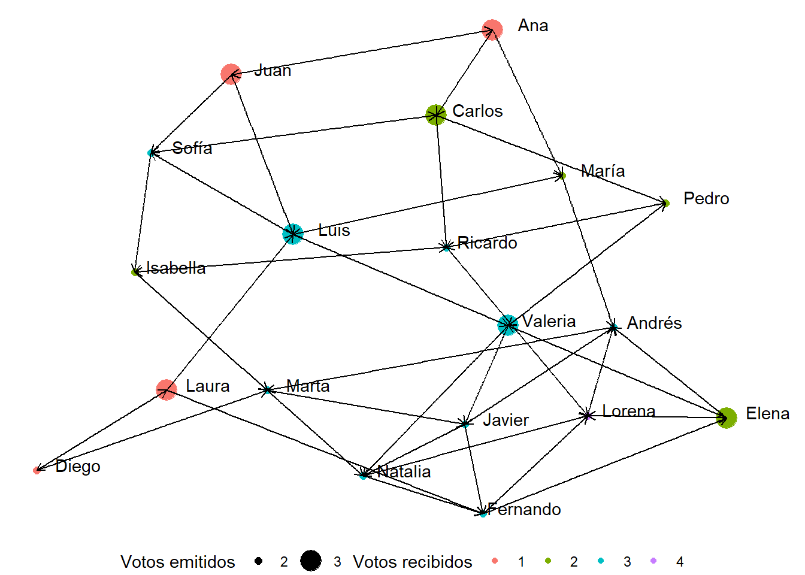
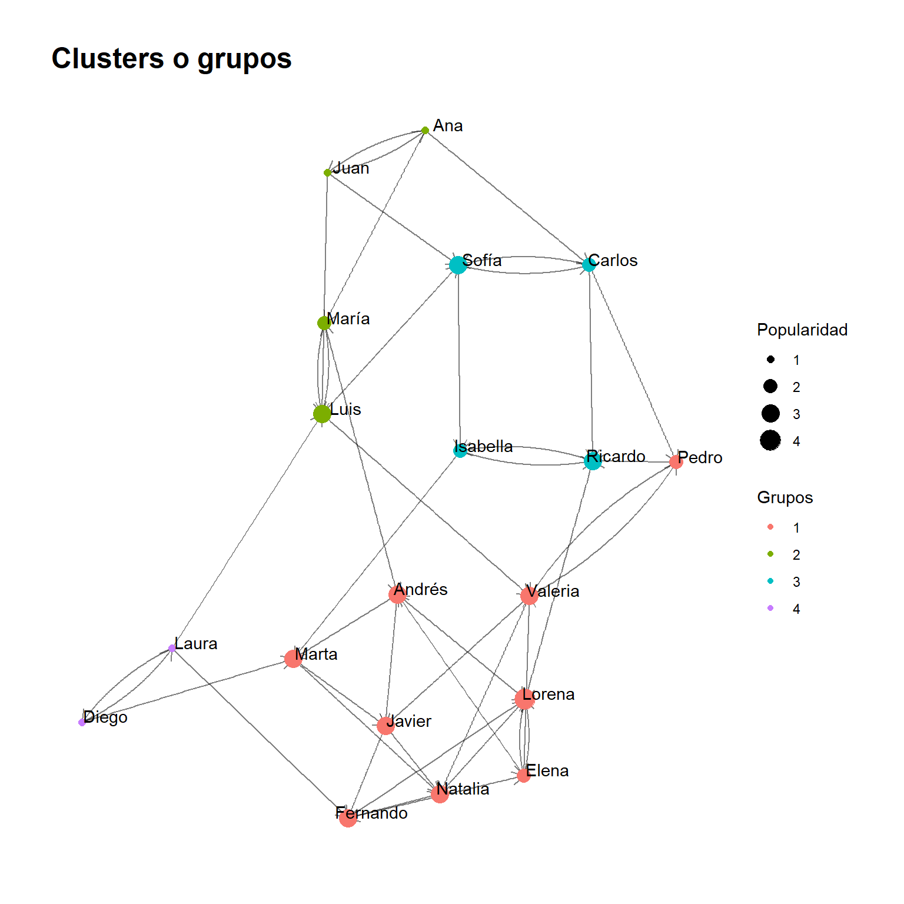

Untitled
================

``` r
tus_datos <- data.frame(
  Estudiante = c(
    "Juan", "Ana", "Luis", "María", "Carlos", "Sofía", "Diego", "Elena",
    "Andrés", "Laura", "Pedro", "Valeria", "Ricardo", "Isabella",
    "Marta", "Javier", "Natalia", "Fernando", "Lorena"
  ),
  Amigos = I(list(
    c("Ana", "Luis", "Sofía"),
    c("Juan", "María", "Carlos"),
    c("María", "Sofía", "Valeria"),
    c("Luis", "Andrés"),
    c("Sofía", "Pedro", "Ricardo"),
    c("Carlos", "Isabella"),
    c("Laura", "Marta"),
    c("Andrés", "Valeria", "Lorena"),
    c("Marta", "Javier"),
    c("Diego", "Luis", "Fernando"),
    c("Valeria", "Ricardo"),
    c("Pedro", "Javier", "Natalia"),
    c("Isabella", "Lorena"),
    c("Ricardo", "Marta"),
    c("Javier", "Natalia"),
    c("Natalia", "Fernando"),
    c("Fernando", "Lorena"),
    c("Lorena", "Elena"),
    c("Elena", "Andrés")
  ))
)
```

``` r
a = c()
amigos_separados <- strsplit(as.character(tus_datos$Amigos), ", ")
for(i in 1:length(amigos_separados)){
  a[i] = length(amigos_separados[[i]])
}
a = max(a)

mat_nombres = matrix(ncol=a,nrow=length(amigos_separados))
for(i in 1:length(amigos_separados)){
  for(j in 1:a){
    
    bla = str_replace_all(amigos_separados[[i]][j],negated_char_class(WRD),"")
    mat_nombres[i,j] = str_replace_all(bla,START%R%"c","")
  }
}
```

``` r
datos_socio = data.frame(cbind(Estudiante=tus_datos$Estudiante,mat_nombres)) %>% gather(key=bla,value=amigo,-1) %>% select(1,3) %>% 
  filter(is.na(amigo)==F) %>% 
  filter(!(Estudiante == amigo))

datos_socio <- unique(datos_socio[c("Estudiante", "amigo")])
```

## A través de igraph

``` r
social_net = graph.data.frame(datos_socio)
adjacency_matrix<-get.adjacency(social_net) ## obtener matriz:
data.frame(as.matrix(adjacency_matrix)) ## obtener dataframe:
```

    ##          Juan Ana Luis María Carlos Sofía Diego Elena Andrés Laura Pedro
    ## Juan        0   1    1     0      0     1     0     0      0     0     0
    ## Ana         1   0    0     1      1     0     0     0      0     0     0
    ## Luis        0   0    0     1      0     1     0     0      0     0     0
    ## María       0   0    1     0      0     0     0     0      1     0     0
    ## Carlos      0   0    0     0      0     1     0     0      0     0     1
    ## Sofía       0   0    0     0      1     0     0     0      0     0     0
    ## Diego       0   0    0     0      0     0     0     0      0     1     0
    ## Elena       0   0    0     0      0     0     0     0      1     0     0
    ## Andrés      0   0    0     0      0     0     0     0      0     0     0
    ## Laura       0   0    1     0      0     0     1     0      0     0     0
    ## Pedro       0   0    0     0      0     0     0     0      0     0     0
    ## Valeria     0   0    0     0      0     0     0     0      0     0     1
    ## Ricardo     0   0    0     0      0     0     0     0      0     0     0
    ## Isabella    0   0    0     0      0     0     0     0      0     0     0
    ## Marta       0   0    0     0      0     0     0     0      0     0     0
    ## Javier      0   0    0     0      0     0     0     0      0     0     0
    ## Natalia     0   0    0     0      0     0     0     0      0     0     0
    ## Fernando    0   0    0     0      0     0     0     1      0     0     0
    ## Lorena      0   0    0     0      0     0     0     1      1     0     0
    ##          Valeria Ricardo Isabella Marta Javier Natalia Fernando Lorena
    ## Juan           0       0        0     0      0       0        0      0
    ## Ana            0       0        0     0      0       0        0      0
    ## Luis           1       0        0     0      0       0        0      0
    ## María          0       0        0     0      0       0        0      0
    ## Carlos         0       1        0     0      0       0        0      0
    ## Sofía          0       0        1     0      0       0        0      0
    ## Diego          0       0        0     1      0       0        0      0
    ## Elena          1       0        0     0      0       0        0      1
    ## Andrés         0       0        0     1      1       0        0      0
    ## Laura          0       0        0     0      0       0        1      0
    ## Pedro          1       1        0     0      0       0        0      0
    ## Valeria        0       0        0     0      1       1        0      0
    ## Ricardo        0       0        1     0      0       0        0      1
    ## Isabella       0       1        0     1      0       0        0      0
    ## Marta          0       0        0     0      1       1        0      0
    ## Javier         0       0        0     0      0       1        1      0
    ## Natalia        0       0        0     0      0       0        1      1
    ## Fernando       0       0        0     0      0       0        0      1
    ## Lorena         0       0        0     0      0       0        0      0

``` r
plot(social_net)
```


## Algunas funciones y atributos dentro de objetos tipo graph

``` r
V(social_net) # nombre de los vertices
```

    ## + 19/19 vertices, named, from afce6cd:
    ##  [1] Juan     Ana      Luis     María    Carlos   Sofía    Diego    Elena   
    ##  [9] Andrés   Laura    Pedro    Valeria  Ricardo  Isabella Marta    Javier  
    ## [17] Natalia  Fernando Lorena

``` r
degree(social_net) # conexiones
```

    ##     Juan      Ana     Luis    María   Carlos    Sofía    Diego    Elena 
    ##        4        4        6        4        5        5        3        5 
    ##   Andrés    Laura    Pedro  Valeria  Ricardo Isabella    Marta   Javier 
    ##        5        4        4        6        5        4        5        5 
    ##  Natalia Fernando   Lorena 
    ##        5        5        6

``` r
V(social_net)$label = V(social_net)$name # agregar atributos en el objeto, en este caso label
V(social_net)$degree = degree(social_net) # agregar atributos en el objeto, en este caso label
plot(social_net,vertex.color = "green",
     vertex.size=V(social_net)$degree*2)
```


## A través de tidyverse

Desde los datos podemos pasar a algo graficable y utilizables a través
de tbl_graph. Esta función permite en edges especificar los vinculos, en
nodes, especificar información acerca de los nodos. Está el argumento
directed, si es igual a treu, solo va a indicar la cantidad de votos
favorables que tuvo la persona, y si lo ponemos como false, va a indicar
el total de votos emitidos y el total. En este caso, vamos a poner
información de los nodos adicional, que no se genera en la tabla misma.
Esta información será una variable aleatoria de puntaje en nivel
socioemocional por ejemplo, que va de 0 a 5. También vamos a ver cuántos
votos emitió cada uno:

Acá generamos información de cada nodo:

``` r
Estudiante = unique(datos_socio$Estudiante)
bienestar = rbinom(n=length(Estudiante),size = 5,prob = 0.8)
votos_emitidos = datos_socio %>% count(Estudiante) %>% rename(votos_emitidos = n)
info_nodos = data.frame(cbind(Estudiante,bienestar))
info_nodos = info_nodos %>% left_join(votos_emitidos)
```

    ## Joining with `by = join_by(Estudiante)`

Acá podemos generar el tipo de base que es procesable. En ella vamos a
calcular la popularidad

``` r
social_net_tbls <- tbl_graph(edges = datos_socio,directed = TRUE,nodes = info_nodos) ## el directed = TRUE hace que el conteo basado en la centralidad se base en total de votos recibidos o total emitidos + recibidos
#social_net_tbls_directed <- tbl_graph(edges = datos_socio,directed = TRUE) ## esto parece que es el entorno tidyverse
social_net_tbls = social_net_tbls %>% mutate(popularidad = centrality_degree(mode = 'in'))
data.frame(social_net_tbls)
```

    ##    Estudiante bienestar votos_emitidos popularidad
    ## 1        Juan         3              3           1
    ## 2         Ana         3              3           1
    ## 3        Luis         5              3           3
    ## 4       María         4              2           2
    ## 5      Carlos         4              3           2
    ## 6       Sofía         3              2           3
    ## 7       Diego         5              2           1
    ## 8       Elena         4              3           2
    ## 9      Andrés         5              2           3
    ## 10      Laura         3              3           1
    ## 11      Pedro         4              2           2
    ## 12    Valeria         3              3           3
    ## 13    Ricardo         3              2           3
    ## 14   Isabella         3              2           2
    ## 15      Marta         4              2           3
    ## 16     Javier         1              2           3
    ## 17    Natalia         4              2           3
    ## 18   Fernando         5              2           3
    ## 19     Lorena         5              2           4

``` r
## tipos de layout: stress, auto, 
social_net_tbls %>% ggraph(layout = "auto") +                            
  geom_node_point(aes(size = factor(votos_emitidos), color=factor(popularidad))) +                                     
  geom_node_text(aes(label = Estudiante), nudge_y = 0.05, nudge_x = 0.2) + 
  geom_edge_link(arrow = arrow(length = unit(2,"mm"))) +
  theme_void() +
  labs(size = "Votos emitidos", color = "Votos recibidos") +
  theme(legend.position = "bottom")
```

    ## Using "stress" as default layout

    ## Warning: Using size for a discrete variable is not advised.

    ## Warning: Using the `size` aesthetic in this geom was deprecated in ggplot2 3.4.0.
    ## ℹ Please use `linewidth` in the `default_aes` field and elsewhere instead.
    ## This warning is displayed once every 8 hours.
    ## Call `lifecycle::last_lifecycle_warnings()` to see where this warning was
    ## generated.


``` r
## tipos de layout: stress, auto, 
social_net_tbls %>% ggraph(layout = "kk") +                            
  geom_node_point(aes(size = factor(votos_emitidos), color=factor(popularidad))) +                                     
  geom_node_text(aes(label = Estudiante), nudge_y = 0.05, nudge_x = 0.2) + 
  geom_edge_link(arrow = arrow(length = unit(2,"mm"))) +
  theme_void() +
  labs(size = "Votos emitidos", color = "Votos recibidos") +
  theme(legend.position = "bottom")
```

    ## Warning: Using size for a discrete variable is not advised.



``` r
## tipos de layout: stress, auto, 
social_net_tbls %>% ggraph(layout = "auto") +                            
  geom_node_point(aes(size = factor(popularidad), color=factor(popularidad))) +                                     
  geom_node_text(aes(label = Estudiante), nudge_y = 0.05, nudge_x = 0.2) + 
  geom_edge_link(arrow = arrow(length = unit(2,"mm"))) +
  theme_void() +
  labs(size = "Votos recibidos", color = "Votos recibidos") +
  theme(legend.position = "bottom")
```

    ## Using "stress" as default layout

    ## Warning: Using size for a discrete variable is not advised.


``` r
igraph_layouts <- c('star', 'circle', 'gem', 'dh', 'graphopt', 'grid', 'mds', 
                    'randomly', 'fr', 'kk', 'drl', 'lgl')
```

``` r
## tipos de layout: stress, auto, 
social_net_tbls %>% ggraph(layout = igraph_layouts[9]) +                            
  geom_node_point(aes(size = factor(popularidad), color=factor(popularidad))) +                                     
  geom_node_text(aes(label = Estudiante), nudge_y = 0.05, nudge_x = 0.2) + 
  geom_edge_link(arrow = arrow(length = unit(3,"mm")),alpha=0.5,size=2) +
  theme_void() +
  labs(size = "Votos recibidos", color = "Votos recibidos") +
  theme(legend.position = "bottom")
```

    ## Warning in geom_edge_link(arrow = arrow(length = unit(3, "mm")), alpha = 0.5, :
    ## Ignoring unknown parameters: `edge_size`

    ## Warning: Using size for a discrete variable is not advised.


La función geom_edge_fan (0,2) permite que los vínculos recíprocos sean
observables

``` r
## tipos de layout: stress, auto, 
social_net_tbls %>% ggraph(layout = igraph_layouts[9]) +                            
  geom_node_point(aes(size = factor(popularidad), color=factor(popularidad))) +                                     
  geom_node_text(aes(label = Estudiante), nudge_y = 0.05, nudge_x = 0.2) + 
  geom_edge_fan2(arrow = arrow(length = unit(3,"mm")),alpha=0.5,size=2) +
  theme_void() +
  labs(size = "Votos recibidos", color = "Votos recibidos") +
  theme(legend.position = "bottom")
```

    ## Warning in geom_edge_fan2(arrow = arrow(length = unit(3, "mm")), alpha = 0.5, :
    ## Ignoring unknown parameters: `edge_size`

    ## Warning: Using size for a discrete variable is not advised.


# Métricas:

Cuando tenemos una red, podemos identificar la importancia de cada
estudiante en varias métricas, a continuación encontramos un ejemplo:

``` r
medidas_centralidad <- social_net_tbls %>%
  mutate(emitidos = centrality_degree(mode = "out"),
         recibidos = centrality_degree(mode = "in"),
         betweenness = centrality_betweenness(),
         closeness = centrality_closeness(),
         eigen_centrality = centrality_eigen())
```

## Centralidad de intermediación (Betweenness Centrality):

Mide la importancia de un nodo en términos de cuántas veces se encuentra
en el camino más corto entre otros nodos en la red. Los nodos con alta
centralidad de intermediación tienden a ser “puentes” entre grupos de
nodos. Estos nodos son críticos para mantener la conectividad y
facilitar la comunicación entre diferentes partes del grafo. Si se
eliminan nodos con alta centralidad de intermediación, es más probable
que la red se fragmente en componentes aislados.

``` r
## tipos de layout: stress, auto, 
medidas_centralidad %>% ggraph(layout = igraph_layouts[9]) +                            
  geom_node_point(aes(size = factor(popularidad), color=betweenness)) +                                     
  geom_node_text(aes(label = Estudiante), nudge_y = 0.05, nudge_x = 0.2) + 
  geom_edge_fan2(arrow = arrow(length = unit(3,"mm")),alpha=0.5,size=2) +
  theme_void() +
  labs(size = "Votos recibidos", color = "Importancia de puente") +
  theme(legend.position = "bottom") +
  scale_colour_gradientn(colours = c("red2","green2")) +
  labs(title = "Importancia de personas puente")
```

    ## Warning in geom_edge_fan2(arrow = arrow(length = unit(3, "mm")), alpha = 0.5, :
    ## Ignoring unknown parameters: `edge_size`

    ## Warning: Using size for a discrete variable is not advised.


$$C_B(v) = \sum_{s \neq v \neq t} \frac{\sigma_{st}(v)}{\sigma_{st}}$$

Donde:

\$ (\_B(v)) \$ es la centralidad de intermediación del nodo (v).

\$ (\_{st})\$ es el número total de caminos más cortos entre el nodo (s)
y el nodo (t).

\$ (\_{st}(v)) \$ es el número de caminos más cortos entre (s) y (t) que
pasan por el nodo (v).

## Centralidad de cercanía:

Los nodos con una alta Centralidad de Cercanía son considerados
“centrales” en la red porque están más cerca, en términos de la
distancia geodésica, de todos los demás nodos. Esto significa que pueden
comunicarse o transmitir información de manera más eficiente a otros
nodos en la red.

La Centralidad de Cercanía puede ayudar a identificar nodos importantes
que actúan como intermediarios efectivos o puntos de control en una red.
Si necesitas que la información se propague rápidamente o que ciertos
nodos sean accesibles para todos los demás, debes prestar atención a
aquellos con una alta Centralidad de Cercanía.

Por otro lado, los nodos con una baja Centralidad de Cercanía están más
alejados de otros nodos y pueden ser menos eficientes en la comunicación
o la transmisión de información.

``` r
## tipos de layout: stress, auto, 
medidas_centralidad %>% ggraph(layout = igraph_layouts[9]) +                            
  geom_node_point(aes(size = factor(popularidad), color=closeness)) +                                     
  geom_node_text(aes(label = Estudiante), nudge_y = 0.05, nudge_x = 0.2) + 
  geom_edge_fan2(arrow = arrow(length = unit(3,"mm")),alpha=0.5,size=2) +
  theme_void() +
  labs(size = "Votos recibidos", color = "Centralidad y cercanía") +
  theme(legend.position = "bottom") +
  scale_colour_gradientn(colours = c("red2","green2")) +
  labs(title = "Nivel de cercanía")
```

    ## Warning in geom_edge_fan2(arrow = arrow(length = unit(3, "mm")), alpha = 0.5, :
    ## Ignoring unknown parameters: `edge_size`

    ## Warning: Using size for a discrete variable is not advised.


La diferencia entre la medida de betweenness y la de closeness es que
esta última se centra se centra en la eficiencia de la comunicación y la
accesibilidad y es útil donde la rapidez en la difusión de información
es importante. Por otro lado, la de betweenness se centra en la
capacidad de un nodo para actuar como intermediario, y es útil en redes
donde la intermediación es esencial.

Fórmula:

$C_C(v) = 1 / ∑_{u ≠ v} d(u, v)$

donde:

\$ C_C(v) \$ es la distancia basada en cercanía $u$ es un nodo diferente
de v en el grafo. \$ d(u,v)\$ es la distancia más corta (longitud del
camino más corto) entre los nodos $u$ y $v$

### Centralidad del autovector:

La Centralidad de Autovector asigna a un nodo un valor basado en su
capacidad para estar conectado con otros nodos importantes en la red.
Los nodos con una alta Centralidad de Autovector tienden a estar en
posiciones estratégicas en la red y están conectados a otros nodos
influyentes. Esta métrica es útil para identificar nodos que pueden
ejercer influencia indirecta sobre toda la red debido a sus conexiones
con nodos importantes.

``` r
## tipos de layout: stress, auto, 
medidas_centralidad %>% ggraph(layout = igraph_layouts[9]) +                            
  geom_node_point(aes(size = factor(popularidad), color=eigen_centrality)) +                                     
  geom_node_text(aes(label = Estudiante), nudge_y = 0.05, nudge_x = 0.2) + 
  geom_edge_fan2(arrow = arrow(length = unit(3,"mm")),alpha=0.5,size=2) +
  theme_void() +
  labs(size = "Votos recibidos", color = "Influencia") +
  theme(legend.position = "bottom") +
  scale_colour_gradientn(colours = c("red2","green2")) +
  labs(title = "Nivel de importancia e influencia")
```

    ## Warning in geom_edge_fan2(arrow = arrow(length = unit(3, "mm")), alpha = 0.5, :
    ## Ignoring unknown parameters: `edge_size`

    ## Warning: Using size for a discrete variable is not advised.


### Métricas de la red:

Clusters Group_infomap intenta hacer clusters basados en proximidad. Acá
un ejemplo:

``` r
# Calcula el coeficiente de clustering en un grafo
medidas_centralidad %>% 
    mutate(Grupos = as.factor(group_infomap())) %>% 
    ggraph(layout = igraph_layouts[9]) + 
    geom_edge_fan2(arrow = arrow(length = unit(3,"mm")),alpha=0.5,size=2) + 
    geom_node_point(aes(colour = Grupos, size = factor(popularidad))) +
    geom_node_text(aes(label = Estudiante), nudge_y = 0.05, nudge_x = 0.2) +
    theme_graph() +
    labs(title = "Clusters o grupos", size = "Popularidad")
```

    ## Warning in geom_edge_fan2(arrow = arrow(length = unit(3, "mm")), alpha = 0.5, :
    ## Ignoring unknown parameters: `edge_size`

    ## Warning: Using size for a discrete variable is not advised.

    ## Warning in grid.Call(C_stringMetric, as.graphicsAnnot(x$label)): font family
    ## not found in Windows font database

    ## Warning in grid.Call(C_stringMetric, as.graphicsAnnot(x$label)): font family
    ## not found in Windows font database

    ## Warning in grid.Call(C_textBounds, as.graphicsAnnot(x$label), x$x, x$y, : font
    ## family not found in Windows font database

    ## Warning in grid.Call(C_textBounds, as.graphicsAnnot(x$label), x$x, x$y, : font
    ## family not found in Windows font database

    ## Warning in grid.Call(C_stringMetric, as.graphicsAnnot(x$label)): font family
    ## not found in Windows font database

    ## Warning in grid.Call(C_textBounds, as.graphicsAnnot(x$label), x$x, x$y, : font
    ## family not found in Windows font database

    ## Warning in grid.Call(C_textBounds, as.graphicsAnnot(x$label), x$x, x$y, : font
    ## family not found in Windows font database

    ## Warning in grid.Call(C_textBounds, as.graphicsAnnot(x$label), x$x, x$y, : font
    ## family not found in Windows font database

    ## Warning in grid.Call(C_textBounds, as.graphicsAnnot(x$label), x$x, x$y, : font
    ## family not found in Windows font database

    ## Warning in grid.Call(C_textBounds, as.graphicsAnnot(x$label), x$x, x$y, : font
    ## family not found in Windows font database

    ## Warning in grid.Call(C_textBounds, as.graphicsAnnot(x$label), x$x, x$y, : font
    ## family not found in Windows font database



Hay diferentes métodos de clustering, por ejemplo: group_optimal(),
group_components()

``` r
medidas_centralidad %>% 
    mutate(Grupos = as.factor(group_optimal(weights=NULL))) %>% 
    ggraph(layout = igraph_layouts[9]) + 
    geom_edge_fan2(arrow = arrow(length = unit(3,"mm")),alpha=0.5,size=2) + 
    geom_node_point(aes(colour = Grupos, size = factor(popularidad))) +
    geom_node_text(aes(label = Estudiante), nudge_y = 0.05, nudge_x = 0.2) +
    theme_graph() +
    labs(title = "Clusters o grupos", size = "Popularidad")
```

    ## Warning in geom_edge_fan2(arrow = arrow(length = unit(3, "mm")), alpha = 0.5, :
    ## Ignoring unknown parameters: `edge_size`

    ## Warning: Using size for a discrete variable is not advised.

    ## Warning in grid.Call(C_textBounds, as.graphicsAnnot(x$label), x$x, x$y, : font
    ## family not found in Windows font database

    ## Warning in grid.Call(C_textBounds, as.graphicsAnnot(x$label), x$x, x$y, : font
    ## family not found in Windows font database

    ## Warning in grid.Call(C_textBounds, as.graphicsAnnot(x$label), x$x, x$y, : font
    ## family not found in Windows font database

    ## Warning in grid.Call(C_textBounds, as.graphicsAnnot(x$label), x$x, x$y, : font
    ## family not found in Windows font database

    ## Warning in grid.Call(C_textBounds, as.graphicsAnnot(x$label), x$x, x$y, : font
    ## family not found in Windows font database

    ## Warning in grid.Call(C_textBounds, as.graphicsAnnot(x$label), x$x, x$y, : font
    ## family not found in Windows font database

    ## Warning in grid.Call(C_textBounds, as.graphicsAnnot(x$label), x$x, x$y, : font
    ## family not found in Windows font database

    ## Warning in grid.Call(C_textBounds, as.graphicsAnnot(x$label), x$x, x$y, : font
    ## family not found in Windows font database

    ## Warning in grid.Call(C_textBounds, as.graphicsAnnot(x$label), x$x, x$y, : font
    ## family not found in Windows font database

    ## Warning in grid.Call(C_textBounds, as.graphicsAnnot(x$label), x$x, x$y, : font
    ## family not found in Windows font database


Medida de densidad: va entre 0 y 1, es 0 cuando no hay conexiones y es 1
cuando todos los puntos se conectan entre sí

``` r
igraph::edge_density(medidas_centralidad) # 
```

    ## [1] 0.1315789

Diámtro de la red: indica el camino más largo entre nodos. Una extensión
larga implica que hay puntos más lejanos entre sí.

``` r
with_graph(medidas_centralidad, graph_diameter())
```

    ## [1] 7

Distancia promedio entre nodos: indica a qué distancia en promedio se
encuentran 2 nodos. Entre menor sea, más conectada y cohesionada se
encuentra la red

``` r
with_graph(medidas_centralidad, graph_mean_dist())
```

    ## [1] 2.615044

Porporción de triángulos (esto no lo entendí)

``` r
igraph::transitivity(medidas_centralidad)
```

    ## [1] 0.2195122

Proporción de relaciones mutuas respecto al total de relaciones

``` r
igraph::reciprocity(medidas_centralidad,mode = "ratio")
```

    ## [1] 0.1842105

# Anexo:

## Con igraph y luego tidyverse:

Con igraph podemos también poner atributos de los nodos, y luego ocupar
eso para hacer gráficos generando un objeto tipo tbl que podemos usar
con ggraph

``` r
socio_net = graph.data.frame(datos_socio,directed = TRUE)
## Poner atributos:
V(socio_net)$popularidad<-degree(socio_net) ## ponemos popularidad de esta forma
socio_net_tbl = as_tbl_graph(socio_net)
```

``` r
# a este objeto igual podemos ponerle la popularidad de esta forma
graph <- socio_net_tbl %>% mutate(Popularity = centrality_degree(mode = 'in'))
```

### Layouts: kk

``` r
socio_net_tbl %>% ggraph(layout = 'kk', maxiter = 100) + 
  geom_node_point(aes(size = popularidad)) +
  geom_node_text(aes(label = name), nudge_y = 0.05, nudge_x = 0.3) +
  scale_size(range = c(2,10)) +
  geom_edge_link(alpha = 0.25) +
  #geom_node_text(aes(label = name), repel = TRUE) +
  theme_graph()
```

    ## Warning in grid.Call(C_textBounds, as.graphicsAnnot(x$label), x$x, x$y, : font
    ## family not found in Windows font database

    ## Warning in grid.Call(C_textBounds, as.graphicsAnnot(x$label), x$x, x$y, : font
    ## family not found in Windows font database

    ## Warning in grid.Call(C_textBounds, as.graphicsAnnot(x$label), x$x, x$y, : font
    ## family not found in Windows font database

    ## Warning in grid.Call(C_textBounds, as.graphicsAnnot(x$label), x$x, x$y, : font
    ## family not found in Windows font database


### Layouts: auto

``` r
socio_net_tbl %>% ggraph(layout = 'auto') + 
  geom_node_point(aes(size = popularidad)) +
  geom_node_text(aes(label = name), nudge_y = 0.05, nudge_x = 0.3) +
  scale_size(range = c(2,10)) +
  geom_edge_link(alpha = 0.25) +
  #geom_node_text(aes(label = name), repel = TRUE) +
  theme_graph()
```

    ## Using "stress" as default layout

    ## Warning in grid.Call(C_textBounds, as.graphicsAnnot(x$label), x$x, x$y, : font
    ## family not found in Windows font database

    ## Warning in grid.Call(C_textBounds, as.graphicsAnnot(x$label), x$x, x$y, : font
    ## family not found in Windows font database

    ## Warning in grid.Call(C_textBounds, as.graphicsAnnot(x$label), x$x, x$y, : font
    ## family not found in Windows font database

    ## Warning in grid.Call(C_textBounds, as.graphicsAnnot(x$label), x$x, x$y, : font
    ## family not found in Windows font database


