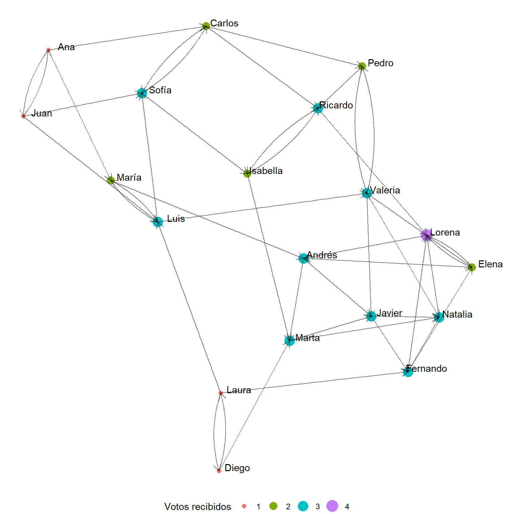
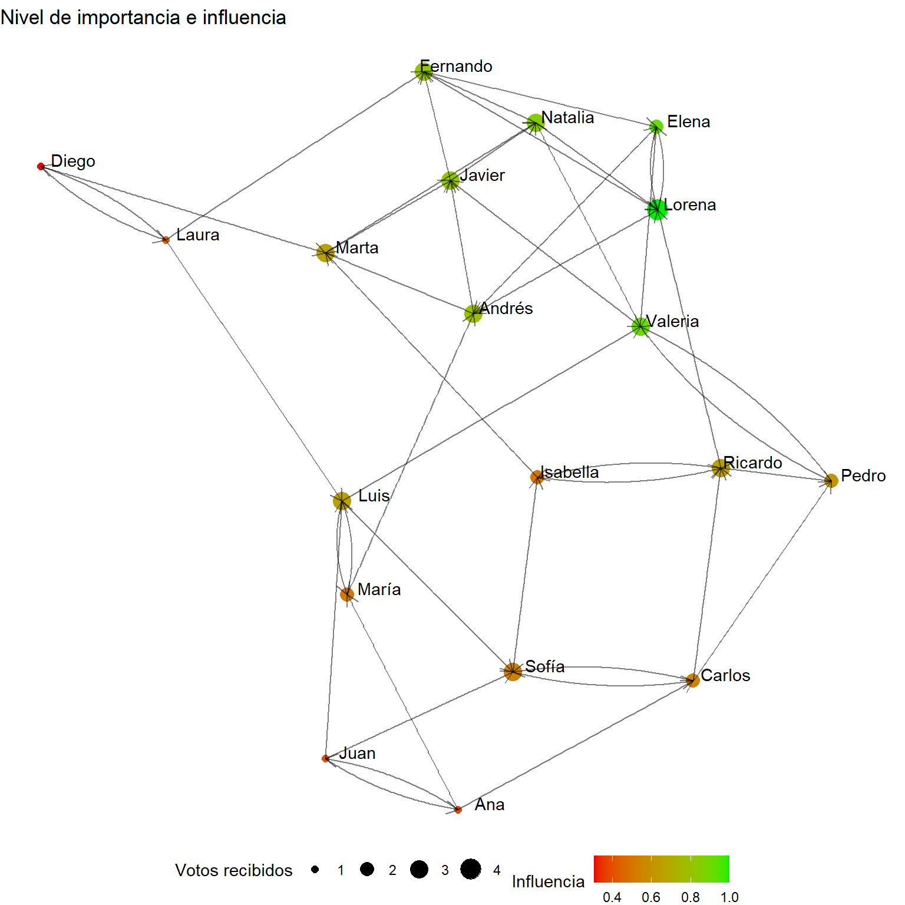

Untitled
================

``` r
tus_datos <- data.frame(
  Estudiante = c(
    "Juan", "Ana", "Luis", "María", "Carlos", "Sofía", "Diego", "Elena",
    "Andrés", "Laura", "Pedro", "Valeria", "Ricardo", "Isabella",
    "Marta", "Javier", "Natalia", "Fernando", "Lorena"
  ),
  Amigos = I(list(
    c("Ana", "Luis", "Sofía"),
    c("Juan", "María", "Carlos"),
    c("María", "Sofía", "Valeria"),
    c("Luis", "Andrés"),
    c("Sofía", "Pedro", "Ricardo"),
    c("Carlos", "Isabella"),
    c("Laura", "Marta"),
    c("Andrés", "Valeria", "Lorena"),
    c("Marta", "Javier"),
    c("Diego", "Luis", "Fernando"),
    c("Valeria", "Ricardo"),
    c("Pedro", "Javier", "Natalia"),
    c("Isabella", "Lorena"),
    c("Ricardo", "Marta"),
    c("Javier", "Natalia"),
    c("Natalia", "Fernando"),
    c("Fernando", "Lorena"),
    c("Lorena", "Elena"),
    c("Elena", "Andrés")
  ))
)
```

``` r
a = c()
amigos_separados <- strsplit(as.character(tus_datos$Amigos), ", ")
for(i in 1:length(amigos_separados)){
  a[i] = length(amigos_separados[[i]])
}
a = max(a)

mat_nombres = matrix(ncol=a,nrow=length(amigos_separados))
for(i in 1:length(amigos_separados)){
  for(j in 1:a){
    
    bla = str_replace_all(amigos_separados[[i]][j],negated_char_class(WRD),"")
    mat_nombres[i,j] = str_replace_all(bla,START%R%"c","")
  }
}
```

``` r
datos_socio = data.frame(cbind(Estudiante=tus_datos$Estudiante,mat_nombres)) %>% gather(key=bla,value=amigo,-1) %>% select(1,3) %>% 
  filter(is.na(amigo)==F) %>% 
  filter(!(Estudiante == amigo))

datos_socio <- unique(datos_socio[c("Estudiante", "amigo")])
```

## A través de igraph

``` r
social_net = graph.data.frame(datos_socio)
adjacency_matrix<-get.adjacency(social_net) ## obtener matriz:
data.frame(as.matrix(adjacency_matrix)) ## obtener dataframe:
```

    ##          Juan Ana Luis María Carlos Sofía Diego Elena Andrés Laura Pedro
    ## Juan        0   1    1     0      0     1     0     0      0     0     0
    ## Ana         1   0    0     1      1     0     0     0      0     0     0
    ## Luis        0   0    0     1      0     1     0     0      0     0     0
    ## María       0   0    1     0      0     0     0     0      1     0     0
    ## Carlos      0   0    0     0      0     1     0     0      0     0     1
    ## Sofía       0   0    0     0      1     0     0     0      0     0     0
    ## Diego       0   0    0     0      0     0     0     0      0     1     0
    ## Elena       0   0    0     0      0     0     0     0      1     0     0
    ## Andrés      0   0    0     0      0     0     0     0      0     0     0
    ## Laura       0   0    1     0      0     0     1     0      0     0     0
    ## Pedro       0   0    0     0      0     0     0     0      0     0     0
    ## Valeria     0   0    0     0      0     0     0     0      0     0     1
    ## Ricardo     0   0    0     0      0     0     0     0      0     0     0
    ## Isabella    0   0    0     0      0     0     0     0      0     0     0
    ## Marta       0   0    0     0      0     0     0     0      0     0     0
    ## Javier      0   0    0     0      0     0     0     0      0     0     0
    ## Natalia     0   0    0     0      0     0     0     0      0     0     0
    ## Fernando    0   0    0     0      0     0     0     1      0     0     0
    ## Lorena      0   0    0     0      0     0     0     1      1     0     0
    ##          Valeria Ricardo Isabella Marta Javier Natalia Fernando Lorena
    ## Juan           0       0        0     0      0       0        0      0
    ## Ana            0       0        0     0      0       0        0      0
    ## Luis           1       0        0     0      0       0        0      0
    ## María          0       0        0     0      0       0        0      0
    ## Carlos         0       1        0     0      0       0        0      0
    ## Sofía          0       0        1     0      0       0        0      0
    ## Diego          0       0        0     1      0       0        0      0
    ## Elena          1       0        0     0      0       0        0      1
    ## Andrés         0       0        0     1      1       0        0      0
    ## Laura          0       0        0     0      0       0        1      0
    ## Pedro          1       1        0     0      0       0        0      0
    ## Valeria        0       0        0     0      1       1        0      0
    ## Ricardo        0       0        1     0      0       0        0      1
    ## Isabella       0       1        0     1      0       0        0      0
    ## Marta          0       0        0     0      1       1        0      0
    ## Javier         0       0        0     0      0       1        1      0
    ## Natalia        0       0        0     0      0       0        1      1
    ## Fernando       0       0        0     0      0       0        0      1
    ## Lorena         0       0        0     0      0       0        0      0

``` r
plot(social_net)
```


## Algunas funciones y atributos dentro de objetos tipo graph

``` r
V(social_net) # nombre de los vertices
```

    ## + 19/19 vertices, named, from ee36b0b:
    ##  [1] Juan     Ana      Luis     María    Carlos   Sofía    Diego    Elena   
    ##  [9] Andrés   Laura    Pedro    Valeria  Ricardo  Isabella Marta    Javier  
    ## [17] Natalia  Fernando Lorena

``` r
degree(social_net) # conexiones
```

    ##     Juan      Ana     Luis    María   Carlos    Sofía    Diego    Elena 
    ##        4        4        6        4        5        5        3        5 
    ##   Andrés    Laura    Pedro  Valeria  Ricardo Isabella    Marta   Javier 
    ##        5        4        4        6        5        4        5        5 
    ##  Natalia Fernando   Lorena 
    ##        5        5        6

``` r
V(social_net)$label = V(social_net)$name # agregar atributos en el objeto, en este caso label
V(social_net)$degree = degree(social_net) # agregar atributos en el objeto, en este caso label
plot(social_net,vertex.color = "green",
     vertex.size=V(social_net)$degree*2)
```


## A través de tidyverse

Desde los datos podemos pasar a algo graficable y utilizables a través
de tbl_graph. Esta función permite en edges especificar los vinculos, en
nodes, especificar información acerca de los nodos. Está el argumento
directed, si es igual a treu, solo va a indicar la cantidad de votos
favorables que tuvo la persona, y si lo ponemos como false, va a indicar
el total de votos emitidos y el total. En este caso, vamos a poner
información de los nodos adicional, que no se genera en la tabla misma.
Esta información será una variable aleatoria de puntaje en nivel
socioemocional por ejemplo, que va de 0 a 5. También vamos a ver cuántos
votos emitió cada uno:

Acá generamos información de cada nodo:

``` r
Estudiante = unique(datos_socio$Estudiante)
bienestar = rbinom(n=length(Estudiante),size = 5,prob = 0.8)
votos_emitidos = datos_socio %>% count(Estudiante) %>% rename(votos_emitidos = n)
info_nodos = data.frame(cbind(Estudiante,bienestar))
info_nodos = info_nodos %>% left_join(votos_emitidos)
```

    ## Joining with `by = join_by(Estudiante)`

Acá podemos generar el tipo de base que es procesable. En ella vamos a
calcular la popularidad

``` r
social_net_tbls <- tbl_graph(edges = datos_socio,directed = TRUE,nodes = info_nodos) ## el directed = TRUE hace que el conteo basado en la centralidad se base en total de votos recibidos o total emitidos + recibidos
#social_net_tbls_directed <- tbl_graph(edges = datos_socio,directed = TRUE) ## esto parece que es el entorno tidyverse
social_net_tbls = social_net_tbls %>% mutate(popularidad = centrality_degree(mode = 'in'))
data.frame(social_net_tbls)
```

    ##    Estudiante bienestar votos_emitidos popularidad
    ## 1        Juan         4              3           1
    ## 2         Ana         4              3           1
    ## 3        Luis         4              3           3
    ## 4       María         5              2           2
    ## 5      Carlos         2              3           2
    ## 6       Sofía         5              2           3
    ## 7       Diego         5              2           1
    ## 8       Elena         2              3           2
    ## 9      Andrés         4              2           3
    ## 10      Laura         3              3           1
    ## 11      Pedro         5              2           2
    ## 12    Valeria         4              3           3
    ## 13    Ricardo         3              2           3
    ## 14   Isabella         3              2           2
    ## 15      Marta         3              2           3
    ## 16     Javier         5              2           3
    ## 17    Natalia         5              2           3
    ## 18   Fernando         4              2           3
    ## 19     Lorena         5              2           4

``` r
## tipos de layout: stress, auto, 
social_net_tbls %>% ggraph(layout = "auto") +                            
  geom_node_point(aes(size = factor(votos_emitidos), color=factor(popularidad))) +                                     
  geom_node_text(aes(label = Estudiante), nudge_y = 0.05, nudge_x = 0.2) + 
  geom_edge_link(arrow = arrow(length = unit(2,"mm"))) +
  theme_void() +
  labs(size = "Votos emitidos", color = "Votos recibidos") +
  theme(legend.position = "bottom")
```

    ## Using "stress" as default layout

    ## Warning: Using size for a discrete variable is not advised.

    ## Warning: Using the `size` aesthetic in this geom was deprecated in ggplot2 3.4.0.
    ## ℹ Please use `linewidth` in the `default_aes` field and elsewhere instead.
    ## This warning is displayed once every 8 hours.
    ## Call `lifecycle::last_lifecycle_warnings()` to see where this warning was
    ## generated.


``` r
## tipos de layout: stress, auto, 
social_net_tbls %>% ggraph(layout = "kk") +                            
  geom_node_point(aes(size = factor(votos_emitidos), color=factor(popularidad))) +                                     
  geom_node_text(aes(label = Estudiante), nudge_y = 0.05, nudge_x = 0.2) + 
  geom_edge_link(arrow = arrow(length = unit(2,"mm"))) +
  theme_void() +
  labs(size = "Votos emitidos", color = "Votos recibidos") +
  theme(legend.position = "bottom")
```

    ## Warning: Using size for a discrete variable is not advised.


``` r
## tipos de layout: stress, auto, 
social_net_tbls %>% ggraph(layout = "auto") +                            
  geom_node_point(aes(size = factor(popularidad), color=factor(popularidad))) +                                     
  geom_node_text(aes(label = Estudiante), nudge_y = 0.05, nudge_x = 0.2) + 
  geom_edge_link(arrow = arrow(length = unit(2,"mm"))) +
  theme_void() +
  labs(size = "Votos recibidos", color = "Votos recibidos") +
  theme(legend.position = "bottom")
```

    ## Using "stress" as default layout

    ## Warning: Using size for a discrete variable is not advised.


``` r
igraph_layouts <- c('star', 'circle', 'gem', 'dh', 'graphopt', 'grid', 'mds', 
                    'randomly', 'fr', 'kk', 'drl', 'lgl')
```

``` r
## tipos de layout: stress, auto, 
social_net_tbls %>% ggraph(layout = igraph_layouts[9]) +                            
  geom_node_point(aes(size = factor(popularidad), color=factor(popularidad))) +                                     
  geom_node_text(aes(label = Estudiante), nudge_y = 0.05, nudge_x = 0.2) + 
  geom_edge_link(arrow = arrow(length = unit(3,"mm")),alpha=0.5,size=2) +
  theme_void() +
  labs(size = "Votos recibidos", color = "Votos recibidos") +
  theme(legend.position = "bottom")
```

    ## Warning in geom_edge_link(arrow = arrow(length = unit(3, "mm")), alpha = 0.5, :
    ## Ignoring unknown parameters: `edge_size`

    ## Warning: Using size for a discrete variable is not advised.


La función geom_edge_fan (0,2) permite que los vínculos recíprocos sean
observables

``` r
## tipos de layout: stress, auto, 
social_net_tbls %>% ggraph(layout = igraph_layouts[9]) +                            
  geom_node_point(aes(size = factor(popularidad), color=factor(popularidad))) +                                     
  geom_node_text(aes(label = Estudiante), nudge_y = 0.05, nudge_x = 0.2) + 
  geom_edge_fan2(arrow = arrow(length = unit(3,"mm")),alpha=0.5,size=2) +
  theme_void() +
  labs(size = "Votos recibidos", color = "Votos recibidos") +
  theme(legend.position = "bottom")
```

    ## Warning in geom_edge_fan2(arrow = arrow(length = unit(3, "mm")), alpha = 0.5, :
    ## Ignoring unknown parameters: `edge_size`

    ## Warning: Using size for a discrete variable is not advised.



### Con igraph y luego tidyverse:

Con igraph podemos también poner atributos de los nodos, y luego ocupar
eso para hacer gráficos generando un objeto tipo tbl que podemos usar
con ggraph

``` r
socio_net = graph.data.frame(datos_socio,directed = TRUE)
## Poner atributos:
V(socio_net)$popularidad<-degree(socio_net) ## ponemos popularidad de esta forma
socio_net_tbl = as_tbl_graph(socio_net)
```

``` r
# a este objeto igual podemos ponerle la popularidad de esta forma
graph <- socio_net_tbl %>% mutate(Popularity = centrality_degree(mode = 'in'))
```

### Layouts: kk

``` r
socio_net_tbl %>% ggraph(layout = 'kk', maxiter = 100) + 
  geom_node_point(aes(size = popularidad)) +
  geom_node_text(aes(label = name), nudge_y = 0.05, nudge_x = 0.3) +
  scale_size(range = c(2,10)) +
  geom_edge_link(alpha = 0.25) +
  #geom_node_text(aes(label = name), repel = TRUE) +
  theme_graph()
```

    ## Warning in grid.Call(C_stringMetric, as.graphicsAnnot(x$label)): font family
    ## not found in Windows font database

    ## Warning in grid.Call(C_stringMetric, as.graphicsAnnot(x$label)): font family
    ## not found in Windows font database

    ## Warning in grid.Call(C_textBounds, as.graphicsAnnot(x$label), x$x, x$y, : font
    ## family not found in Windows font database

    ## Warning in grid.Call(C_textBounds, as.graphicsAnnot(x$label), x$x, x$y, : font
    ## family not found in Windows font database


### Layouts: auto

``` r
socio_net_tbl %>% ggraph(layout = 'auto') + 
  geom_node_point(aes(size = popularidad)) +
  geom_node_text(aes(label = name), nudge_y = 0.05, nudge_x = 0.3) +
  scale_size(range = c(2,10)) +
  geom_edge_link(alpha = 0.25) +
  #geom_node_text(aes(label = name), repel = TRUE) +
  theme_graph()
```

    ## Using "stress" as default layout

    ## Warning in grid.Call(C_textBounds, as.graphicsAnnot(x$label), x$x, x$y, : font
    ## family not found in Windows font database

    ## Warning in grid.Call(C_textBounds, as.graphicsAnnot(x$label), x$x, x$y, : font
    ## family not found in Windows font database

    ## Warning in grid.Call(C_textBounds, as.graphicsAnnot(x$label), x$x, x$y, : font
    ## family not found in Windows font database

    ## Warning in grid.Call(C_textBounds, as.graphicsAnnot(x$label), x$x, x$y, : font
    ## family not found in Windows font database


